# Agent Manager Template

A GitHub template repository for teams using AI coding assistants (Claude, Windsurf, Cline, etc.) with structured Kanban workflow governance.

## What This Is

This repository provides:

1. **Kanban-as-Code** — Your project board lives in `Features/` folder structure, version-controlled with git
2. **Agent Governance** — Clear rules for when AI agents write design docs vs code vs tests
3. **CSV Sync** — Bidirectional sync between folder structure and `tasks.csv` for Google Sheets/GitHub Projects import
4. **Onboarding Scripts** — One-command setup to install Kanban rules into agent memory

## Who This Is For

If you want to use AI coding assistants (Claude, Windsurf, Cline, etc.) with structured workflow governance, this template is for you.

You will build a team in your IDE of choice with each agent having specific roles and responsibilities and work together to complete tasks in a structured Kanban workflow where you (the human) gatekeep task transitions.

## How It Works

### Kanban Board as Folders

```
Features/
├── 1-Backlog/          # Raw ideas
├── 2-HLD/              # High Level Design docs
├── 3-TaskReview/       # Architect sign-off queue
├── 4-Implementation/   # Active coding
├── 5-Testing-Agent/    # Automated test suite
├── 6-Testing-Manual/   # Human QA
├── 7-Verified/         # Ready for PR
├── 8-Review/           # PR open
└── 9-Done/             # Merged & complete
```

Stories are markdown files that move between folders as they progress.

### Full Workflow Diagram

```mermaid
flowchart TD
    subgraph BACKLOG["1 · Backlog  👤 Human"]
        B_in["Feature stub\n─────────────\n· title\n· scope\n· out-of-scope"]
    end

    subgraph HLD["2 · HLD  🤖 Architect Agent"]
        H_in["Feature design\n─────────────\n· C4 L1 Context diagram\n· C4 L2 Container diagram\n· Components & data model\n· Stories decomposed here"]
    end

    subgraph TASKREVIEW["3 · TaskReview  🤖 Architect Agent  →  👤 CTO approves"]
        TR_in["Per-story LLD\n─────────────\n· C4 L3 Component diagram\n· Interface contracts\n· Sequence diagrams\n· Gherkin acceptance criteria"]
    end

    subgraph IMPL["4 · Implementation  🤖 Agent"]
        I_in["Code\n─────────────\n· Tests written first (TDD)\n· Implements LLD contracts\n· Updates Gherkin checklist"]
    end

    subgraph TEST["5/6 · Testing"]
        TA["5 · Testing-Agent  🤖\n─────────────\nUnit · Integration\nAcceptance (Gherkin)\nV-Model: all levels"]
        TM["6 · Testing-Manual  👤\n─────────────\nExploratory · UX\nEdge cases requiring\nhuman judgment"]
    end

    subgraph VERIFY["7 · Verified  👤 Human"]
        V_in["Human approval\n─────────────\nAll tests pass\nAcceptance criteria met"]
    end

    subgraph REVIEW["8 · Review  👤 Human"]
        R_in["PR open\n─────────────\nCode review\nFeedback addressed"]
    end

    subgraph DONE["9 · Done  👤 Human"]
        D_in["PR merged\n─────────────\nFeature complete"]
    end

    BACKLOG -->|"Human moves\nfeature to HLD"| HLD
    HLD -->|"Agent signals ready\nHuman moves"| TASKREVIEW
    TASKREVIEW -->|"CTO commits move"| IMPL
    IMPL -->|"Agent routes"| TA
    IMPL -->|"Agent routes\n(can't automate)"| TM
    TA -->|"All pass"| VERIFY
    TA -->|"Needs human QA"| TM
    TM --> VERIFY
    VERIFY -->|"Human moves"| REVIEW
    REVIEW -->|"PR merged"| DONE

    TA -->|"Tests fail"| IMPL

    style BACKLOG fill:#f5f5f5,stroke:#999
    style HLD fill:#dbeafe,stroke:#3b82f6
    style TASKREVIEW fill:#dbeafe,stroke:#3b82f6
    style IMPL fill:#dcfce7,stroke:#16a34a
    style TEST fill:#fef9c3,stroke:#ca8a04
    style VERIFY fill:#f3e8ff,stroke:#9333ea
    style REVIEW fill:#f3e8ff,stroke:#9333ea
    style DONE fill:#d1fae5,stroke:#059669
```



### V-Model Alignment

The Kanban left leg (design) maps to the V-Model and its right leg (testing):

```
DESIGN ──────────────────────────────────────────── TESTING
                                                            
Backlog    Requirements / feature intent    ←→  E2E / Gherkin acceptance tests
HLD        Architecture (C4 L1/L2)         ←→  Container smoke tests
TaskReview Design (C4 L3 / LLD)            ←→  Integration tests
Implement  Code                            ←→  Unit tests
```

### Human vs Agent Responsibilities

| Who | Does |
|-----|------|
| **Human** | Creates feature stubs, moves stories between columns, approves gates, merges PRs |
| **Architect agent** | Writes HLD, decomposes stories, writes LLD + Gherkin per story |
| **Implementation agent** | Writes tests and code from LLD contracts |
| **Testing agent** | Runs all test levels, verifies Gherkin, routes to Verified or Testing-Manual |

Agents never move stories. Humans commit all column transitions.

### Getting Started

1. **Use this template** to create your project repo
2. **Run onboarding** to install Kanban rules:
   ```bash
   ./scripts/windsurf_onboarding.sh
   ```
3. **Create feature stubs** in `Features/1-Backlog/{epic}/0001-feature-name.md` (stories are written later, as output of HLD)
4. **Move stories** through columns via git mv and commit

## Documentation

- `KANBAN.md` — Full column definitions and workflow rules
- `Features/` — Where you create and move story files organized by status
- `.windsurfrules` — Windsurf agent behavior rules
- `CLAUDE.md` — Claude Code agent behavior rules
- `.clinerules` — Cline agent behavior rules

## Repository Structure

```
├── Features/              # Kanban board (authoritative source)
├── scripts/               # Onboarding and sync utilities
├── Docs/                  # Additional documentation
├── KANBAN.md             # Main workflow rules for ai agents
└── tasks.csv             # Generated Kanban export
```

## License

MIT — Use this template for your own projects.
