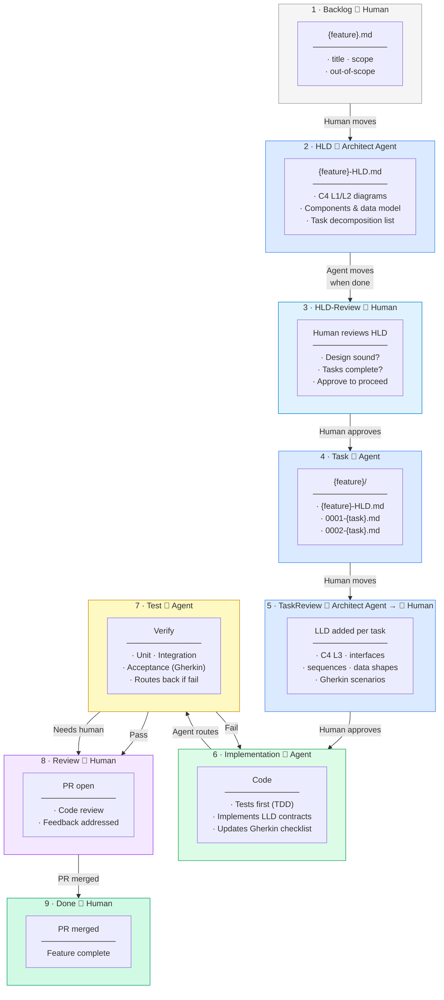

### Full Workflow Diagram



### V-Model Alignment

The Kanban left leg (design) maps to the V-Model and its right leg (testing):

```
DESIGN ──────────────────────────────────────────── TESTING
                                                            
Backlog    Requirements / feature intent    ←→  E2E / Gherkin acceptance tests
HLD        Architecture (C4 L1/L2)         ←→  Container smoke tests
TaskReview Design (C4 L3 / LLD)            ←→  Integration tests
Implement  Code                            ←→  Unit tests
```

### Human vs Agent Responsibilities

| Who | Does |
|-----|------|
| **Human** | Creates feature stubs, moves stories between columns, approves gates, merges PRs |
| **Architect agent** | Writes HLD, decomposes stories, writes LLD + Gherkin per story |
| **Implementation agent** | Writes tests and code from LLD contracts |
| **Testing agent** | Runs all test levels, verifies Gherkin, routes to Verified or Testing-Manual |

Agents never move stories. Humans commit all column transitions.

