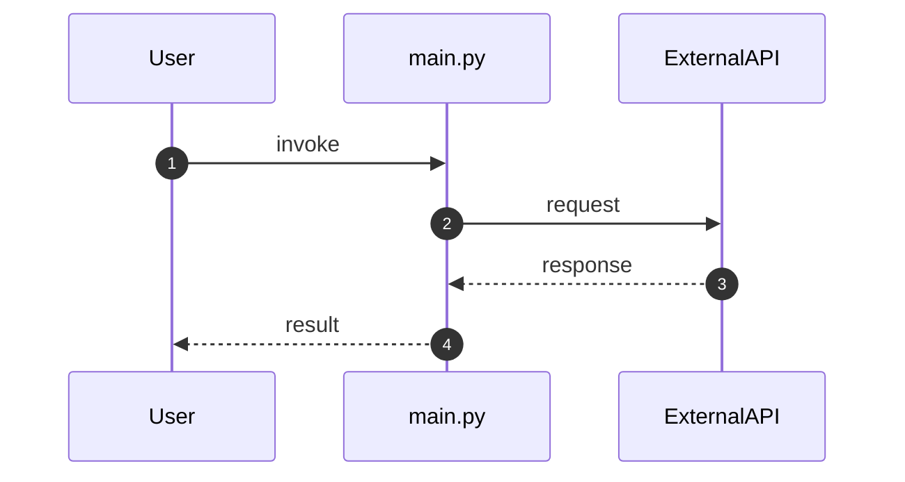
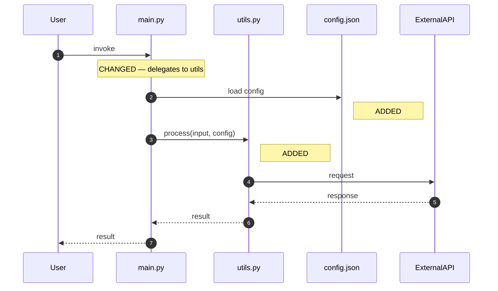

# Feature HLD Template

Use this template when creating a **Feature** for the HLD Review (3-HLD-Review column).

The HLD (High-Level Design) is the architecture before implementation. It answers: **What**, **Why**, **Scope**, **Architecture**, **Acceptance Criteria**, and **Test Conditions**.

---

```markdown
---
id: xxxx <Four char uuid>
epic: yyyy
feature: xxxx
title: <Feature Name>
type: feature
assignee: architect
review_gate: yes
approved: no
priority: high
depends_on: ""
---

## Feature

**What:** <One sentence: what does this feature do?>

**Why:** <One sentence: why is this needed? What problem does it solve?>

**Scope:**
- <Item 1>
- <Item 2>
- <Item 3>

**Out of Scope:**
- <Explicitly what is NOT included>
- <Prevents scope creep>

## Design Principles: Think Big, Act Small + Open-Closed

**Think Big, Act Small:**
- **Vision (HLD):** Show the full future scope (what could evolve)
- **Implementation (Tasks):** Build only what's needed now
- **Interface design:** Extensible for future, not over-abstracted for it

**Open-Closed Principle (OCP):**
- **Open for extension:** New features can be added without modifying existing code
- **Closed for modification:** Existing code doesn't change when you extend it
- Design interfaces and abstractions that anticipate change, but don't build the change

**Good example:**
- HLD says: "Design for multiple auth methods (OAuth2, SAML, LDAP)"
- Implementation builds: OAuth2 only, with a clean auth interface (not magic strings, not hardcoded)
  ```python
  # Interface is closed: doesn't change when new auth methods added
  class AuthProvider:
      def authenticate(self, credentials) -> User: ...
  
  # Implement OAuth2
  class OAuth2Provider(AuthProvider): ...
  
  # Future: Add SAML without touching existing OAuth2 or core code
  class SAMLProvider(AuthProvider): ...
  ```
- Result: Simple now, extensible later, OCP respected

**Bad example:**
- Implementation builds: A plugin system, generic config framework, abstract auth layer
- Result: Over-engineered for one current use case (you built SAML/LDAP you don't use yet)

**Anti-pattern:**
- Building for an imagined future: "What if we need to support X in 3 years?"
- Instead: Design the interface so X can be added cleanly, but don't implement it. If not sure, leave as open question.
- **Escalation:** If open question blocks progress, escalate to senior now (don't let it sit and PAUSE for response. when response given, ask to RESUME your task)

---

## Design Principle: SRP with Pragmatism (Clustering vs Splitting)

**Single Responsibility Principle (SRP):** Each class/module has one reason to change.

**But:** Blindly splitting leads to over-fragmentation, high coupling, orchestration complexity.

**Pragmatic rule:** Always CBA. Cluster related responsibilities or split them based on:

**Cluster if:**
- Responsibilities change together (same release cycle, same team reason)
- Coupling them reduces overall complexity
- Splitting would require orchestration logic
- Example: User validation + User serialization → cluster (both about user data shape)

**Split if:**
- Responsibilities change for different reasons (different teams, different lifecycles)
- Splitting reduces cognitive load (each module is small, focused)
- Reusability matters (need to use one without the other)
- Example: Database connection ↔ Query builder → split (connection changes with db vendor, query changes with domain)

**CBA Matrix for Splitting:**

| Factor | Clustered | Split |
|--------|---|---|
| **Cohesion** | High (related logic together) | Lower (may feel forced apart) |
| **Coupling** | Internal (within module) | External (need orchestration) |
| **Testability** | Test both together | Test independently |
| **Reusability** | Less flexible | More flexible |
| **Cognitive load** | Higher (more code per file) | Lower (each file focused) |
| **Orchestration** | None | Added complexity |

**Decision:**
- If `cohesion + coupling benefit > orchestration + cognitive overhead` → Cluster
- Otherwise → Split
- **Always document the CBA that led to your choice**

**Examples:**

❌ **Over-split:**
```
UserRepository.py (5 lines)
UserValidator.py (10 lines)
UserSerializer.py (8 lines)
UserNotifier.py (6 lines)
UserOrchestrator.py (40 lines) ← orchestration logic!
```

✅ **Pragmatic:**
```
User.py (40 lines: model + validation + serialization)
UserNotifier.py (6 lines: separate reason to change = business rules)
```

Or:
```
UserModel.py (20 lines: data shape)
UserService.py (30 lines: validation + serialization + logic)
Notifier.py (general notification service, not user-specific)
```

---

## Architecture & Flow

**What's the workflow/process?**

Use **Mermaid** sequence or activity diagrams. Show two blocks: **CURRENT** (as-is) and **TARGET** (to-be), annotating what is ADDED, REMOVED, or CHANGED.

* Better is box of current and future one under the other (diff style)
* if that doesn't work, use two separate diagrams

### Current Sequence (as-is)



### Target Sequence (to-be)



### Change Summary

| Component | Change | Notes |
|-----------|--------|-------|
| main.py | CHANGED | Now delegates processing to utils.py |
| utils.py | ADDED | New module for processing logic |
| config.json | ADDED | Externalized configuration |
| (legacy inline-processing branch) | REMOVED | Replaced by utils.py |

> **Alternative:** Use an activity/flowchart diagram (`graph TD` / `flowchart LR`) when the flow is not message-based. Still provide two blocks (CURRENT vs TARGET) and a change summary table.

---

## Components: Existing, New, Changed

For each component in the flow, document:

| Component | Status | File | Library vs Custom | Decision |
|-----------|--------|------|---|---|
| Git operations | CHANGED | push_template.py | GitPython vs subprocess | **DECIDED:** Use GitPython (see CBA below) |
| Artifact filtering | NEW | push_template.py | Custom code vs library | **DECIDED:** Custom (no library exists, <30 LOC) |
| Cache initialization | CHANGED | push_template.sh | Native bash vs bash library | **DECIDED:** Native bash (shell-native) |
| [Component 4] | [Status] | [File] | [Library vs Custom] | **OPEN:** To be decided at review |

---

## Library vs Custom Decisions (CBA Matrices)

**Decision preference order (strict):** Standards → Libraries → Docker images → Custom (last resort)

**For each decision: Either DECIDED (with sources) or OPEN (with evaluation criteria)**

---

### Decision 1: Git Operations — GitPython vs subprocess

| Factor | GitPython | subprocess |
|--------|---|---|
| **Popularity** | 2.3K GitHub stars, maintained | None (stdlib) |
| **Industry standard** | De facto standard for Python git | Shell native |
| **Cost: Learning** | 2 hrs (API) | 1 hr (commands) |
| **Cost: Maintenance** | 0 (community) | High (boilerplate) |
| **Cost: LOC** | ~40 lines | ~200+ lines |
| **Risk** | Low (mature, widely used) | High (edge cases, injection) |

**DECIDED:** ✅ **Use GitPython**

**Sources:**
- GitHub: https://github.com/gitpython-developers/GitPython (2.3K ⭐, actively maintained)
- PyPI: https://pypi.org/project/GitPython/ (millions of downloads)
- Used by: Mercurial, Apache projects, industry standard

**Rationale:** Multi-star library, de facto standard. Maintenance cost and risk far exceed learning curve.

---

### Decision 2: Authentication — Auth0 vs custom JWT

| Factor | Auth0 | Custom JWT |
|--------|---|---|
| **Industry standard** | Yes (OAuth2, OIDC) | No (reinventing) |
| **Cost: Learning** | 4 hrs (setup) | 8 hrs (design, security) |
| **Cost: Maintenance** | 0 (SaaS) | High (security patches, token refresh) |
| **Cost: Security** | Compliant (SOC2, GDPR) | Risky (crypto edge cases) |
| **Cost: Free tier** | Yes (up to 7K users) | Custom code |

**DECIDED:** ✅ **Use Auth0 (or Auth0-equivalent)**

**Sources:**
- Industry standard: OAuth2/OIDC specs (https://oauth.net/2/)
- Auth0 free tier: https://auth0.com/pricing
- Alternatives: Okta, Firebase Auth, Keycloak (open source)

**Rationale:** Industry standard, free tier available, security guarantees. Custom JWT puts security burden on us.

---

### Decision 3: Database — PostgreSQL Docker image vs custom schema setup

| Factor | Official Docker Image | Custom SQL setup |
|--------|---|---|
| **Standard** | Yes (Docker standard, PostgreSQL official) | No (reinventing) |
| **Popularity** | 1M+ pulls, verified | Custom code |
| **Cost: Setup** | 0 (use image) | 4 hrs (schema design, migration) |
| **Cost: Maintenance** | 0 (community) | High (backups, upgrades, tuning) |
| **Cost: Security** | Audited (official image) | Custom (vulnerabilities likely) |

**DECIDED:** ✅ **Use Official PostgreSQL Docker image**

**Sources:**
- Docker Hub official: https://hub.docker.com/_/postgres (1M+ pulls, verified)
- Use: `docker run -d postgres:latest`
- Configuration: Environment variables in docker-compose.yml

**Rationale:** Official standard. No benefit from custom setup. Use the container.

---

### Decision 4: Artifact Filtering — Custom vs library

| Factor | Custom | Library (if exists) |
|--------|---|---|
| **Standard** | No | No |
| **Popularity** | N/A | N/A |
| **LOC** | ~30 lines | N/A |
| **Risk** | Low (testable, domain-specific) | N/A |

**DECIDED:** ✅ **Use Custom Code**

**Sources:**
- Searched PyPI: `pip search "git filter"` — no results
- Searched GitHub: "gitpython filter" — found only full wrappers, not filtering
- Decided: Custom is small, maintainable, testable, domain-specific. No standard or library exists.

**Rationale:** No standard, no library. Custom is appropriate here.

---

### Decision 4: GPS Tracking — Traccar vs custom Node.js

| Factor | Traccar | Custom Node.js |
|--------|---|---|
| **Industry standard** | Yes (de facto for GPS) | No (reinventing) |
| **Popularity** | 5K GitHub ⭐, widely deployed | Custom code |
| **Cost: Building** | 0 (use it) | 200+ LOC |
| **Cost: Maintenance** | 0 (community) | High (protocols, edge cases) |
| **Cost: Security** | Battle-tested | New vulnerabilities likely |
| **Open source** | Yes (AGPL, self-host) | Custom |
| **Free** | Yes (self-host) | Custom code |

**DECIDED:** ✅ **Use Traccar (self-hosted)**

**Sources:**
- GitHub: https://github.com/traccar/traccar (5K ⭐, GPLv3, self-host)
- Industry: Used by 1000+ deployments
- Comparison: https://www.g2.com/products/traccar/competitors

**Rationale:** Industry standard, open source, free, self-hostable. Building custom violates Gate Rule 5 entirely.

---

### Decision 5: [Your decision] — [Option A] vs [Option B]

**OPEN:** To be decided at review

| Factor | Option A | Option B |
|--------|---|---|
| **Standard** | | |
| **Popularity** | | |
| **Cost** | | |

**Evaluation criteria:**
- If [Standard X] is adopted, choose Option A
- If performance matters more than cost, choose Option B
- [Add your decision rule]

**Presenter will bring:** Comparison links, GitHub stars, documentation, or prototypes to help reviewers decide.

---

## Layer Boundary Rules

- Component A handles: [what it does]
- Component B handles: [what it does]
- Invariant: [what must always be true]
- Explicitly: Component A does NOT [X], Component B does NOT [Y]

## Acceptance Criteria

- [ ] <AC 1>
- [ ] <AC 2>
- [ ] <AC 3>

## Test Conditions

**Happy path:** <Scenario description>
- Given: <preconditions>
- When: <action>
- Then: <expected outcome>

**Error path:** <Scenario description>
- Given: <preconditions>
- When: <action>
- Then: <expected outcome>

## Testing: DRY, Flowing, Minimal Setup

**Principle:** One clean test with multiple assertions in logical flow > many fragmented tests with repeated setup/teardown.

**Good test (TDD style, clean flow):**
```python
def test_directory_operations():
    # Create directory
    dir_path = create_temp_dir()
    
    # Assert directory exists
    assert os.path.isdir(dir_path)
    
    # Assert can write
    test_file = os.path.join(dir_path, "test.txt")
    write_file(test_file, "data")
    assert os.path.exists(test_file)
    
    # Assert can copy
    copy_dir = copy_directory(dir_path)
    assert os.path.isdir(copy_dir)
    assert os.path.exists(os.path.join(copy_dir, "test.txt"))
    
    # Cleanup
    cleanup(dir_path, copy_dir)
```

**Bad test (fragmented, bloated):**
```python
def test_is_directory_exists():
    dir_path = create_temp_dir()
    try:
        assert os.path.isdir(dir_path)
    finally:
        cleanup(dir_path)

def test_can_write_dir():
    dir_path = create_temp_dir()
    try:
        test_file = os.path.join(dir_path, "test.txt")
        write_file(test_file, "data")
        assert os.path.exists(test_file)
    finally:
        cleanup(dir_path)

def test_can_copy_directory():
    dir_path = create_temp_dir()
    try:
        copy_dir = copy_directory(dir_path)
        assert os.path.isdir(copy_dir)
    finally:
        cleanup(dir_path, copy_dir)

# 3 tests × (setup + fixtures + try/finally) = massive overhead
```

**DRY in tests:**
- One test for one behavior flow (fails line by line on first problem)
- Minimal setup/teardown bloat
- Fixtures only for truly shared infrastructure, not test-specific setup
- Avoid: test per assertion, repeated setup, pre/post ceremony

---

## Gherkin

```gherkin
Feature: <Feature name>

  Scenario: <Scenario 1>
    Given <precondition>
    When <action>
    Then <outcome>
    
  Scenario: <Scenario 2>
    Given <precondition>
    When <action>
    Then <outcome>
```

## Definition of Done

- [ ] Architecture diagram clear and reviewable
- [ ] Layer boundaries explicitly stated
- [ ] Acceptance criteria measurable and testable
- [ ] Test conditions cover happy path + error paths
- [ ] No ambiguity on which layer owns what
- [ ] Gherkin scenarios align with test conditions

---

## Comments

**YYYY-MM-DD — [role] ([context]):** <what was discussed or changed>
```

---

## Template Notes

- **Architecture & Layer Responsibilities** is MANDATORY if the feature spans multiple layers/components
- Be explicit about what each layer does NOT do (prevents scope creep)
- Acceptance Criteria should reference layer boundaries (e.g., "Component A successfully hands off to Component B")
- If reviewing this HLD, ask: "Which layer owns which responsibility? Is it clear enough to implement without confusion?"
